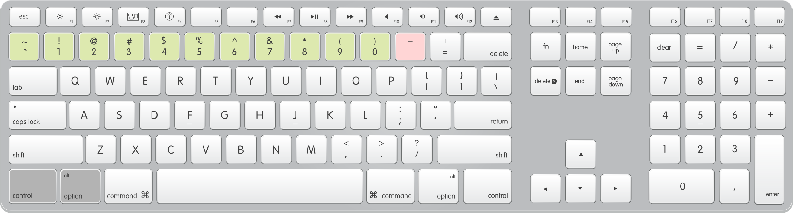

# dayjob

##### Make great Spotify playlists while you work.

## What is it?
dayjob lets you quickly add and remove songs to your playlists by using shortcut keys.  It's an great way to make awesome playlists without being distracted from your work.

It works when playing from any source (playlists, radio, artists, albums etc.) and supports all the Spotify players (desktop, mobile, web) because it uses the Spotify API.  dayjob is written in [Node JS Electron](https://electronjs.org/).

|Play some music on Spotify|When you hear a good song, press a shortcut |dayjob adds it to your playlist|
|:-----:|:-----:|:-----:|
|||

dayjob currently supports adding songs to 11 playlists, and also remove songs you don't like from the current playlist.  Enjoy!

## History
I created this app because I love discovering new tunes while I'm working but wanted to minimise distractions and the time spent in the Spotify app.  I've been using a proof of concept since 2017; finally I've gotten round to releasing a configurable version that everyone can use.

## Download

|Mac|Windows|
|:-----:|:-----:|
|[Download](https://www.dropbox.com)|Interested?  Leave a comment [here](https://github.com/simonmetcalfe/dayjob/issues/1).|

## How to use

### Getting started
1. [Download](#download) dayjob and install
1. Goto the *Spotify Connection* tab in settings
1. Log in to your [Spotify Developer Dashboard](https://developer.spotify.com/dashboard/) and create a new Client ID, e.g.
    * App or Hardware Name:  _dayjob_
    * App or Hardware Description: _Make great Spotify playlists while you work_
    * What are you building?:  _Desktop app_
1. Enter the Client ID and secret into dayjob and authorise

### Add your playlists

Add the playlists you want to be able to add songs to.  Currently 10 playlists are supported using the number keys along the top of the keyboard.

1. Riht-click on a playlist in the Spotify app, and select *Share > Copy Spotify URI*. 
1. Goto the *Playlists* tab in dayjob Settings and paste the playlist URI into an empty slot
1. Press *Get name* to confirm dayjob can locate the playlist
1. Optionally, select *Move songs instead of copying them*, if you want dayjob to remove songs from the source playlist when you press the shortcut key \*
1. Repeat steps 1 to 4 if you want to add additional playlists.

### Adding and removing songs

dayjob uses the following keyboard shortcuts

* For songs you like, use the shorcuts *ctrl + alt + 1* _to_ *0* to add them to your playlists.  
   * 
* For songs you don't like, use the shotcut *ctrl + alt + -* to remove it from the playlist it is playing in \* 
   * 

\* Songs can only be moved or removed from the source playlist if you created the playlist.  If you're playling songs from someone elses playlist, the radio, artists, albums etc., the song won't be removed.

### Development

I'm not a developer by profession so apologise for any bugs or poor coding practices!  dayjob is a simple project and should be easy to maintain.  After cloning use *npm install dayjob* to install.

Currently Node and all modules are set to specific (and some outdated) versions as I had problems with the latest versions causing dayjob to break.  Some maintenance is required here.

  
