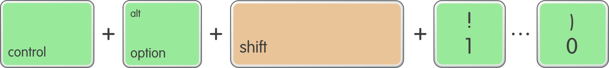

# dayjob
dayjob is a desktop app that lets you add tracks to your favourite playlists by using shortcut keys.  It's a great way to make awesome playlists without being distracted from your work.

- Add tracks from any Spotify source (playlists, radio, Discover Weekly etc.)
- Remove and skip boring tracks from the current playlist
- Supports all Spotify players (desktop, mobile, web)
- Cross-platform (written in [Electron](https://electronjs.org/))
- Zero network usage when idle

|Play some new music|Hear a good tune?  Press a shortcut |dayjob adds it to your playlist|
|:-----:|:-----:|:-----:|
|||

## Download
Before downloading please read the [disclaimer](https://opensource.org/licenses/MIT).

|Mac|Windows|Linux|
|:-----:|:-----:|:-----:|
|[dayjob-1.1.1.dmg](https://github.com/simonmetcalfe/dayjob/releases/download/v1.1.1/dayjob-1.1.1.dmg)|[dayjob-win32-x64_1.1.1.zip](https://github.com/simonmetcalfe/dayjob/releases/download/v1.1.1/dayjob-win32-x64_1.1.1.zip)|Coming soon!|
|v1.1.1|v1.1.1*|Register your interest [here](https://github.com/simonmetcalfe/dayjob/issues/2)|

\* No installer for Windows version yet - drag the 'dayjob-win32-x64' folder from inside the ZIP file into your Users folder, and run dayjob.exe

## Keyboard shortcuts
Add tracks to 10 of your favourite playlists by using the keyboard keys 1, 2, 3, 4, 5, 6, 7, 8 ,9 and 0.

|Shortcut|Function|
|:-----:|:-----:|
|  *CTRL* + *ALT* + *1* ... *0*|Add track to playlist #|
|  *CTRL* + *ALT* + *SHIFT* + *1* ... *0*|Move track to playlist #|
|  *CTRL* + *ALT* + *-*|Remove track from current playlist|
|  *CTRL* + *ALT* + *SHIFT* + *-*|Remove track from current playlist and skip to next song |

## Limitations

* Tracks can only be moved or removed from a playlist if you are the playlist owner
* If you try to move tracks from a read only source (shared playlist, the radio, artists, etc.) dayjob will warn you and copy the track instead

## Getting started
### Icon and notification window
dayjob creates an icon in the the status / tray area of your computer.  It will mostly interact with you through notifications shown here.

### Right-click menu
dayjob will prompt you to set up the Spotify connection on first use, but you use the right-click menu to open the Preferences or to quit at any time.  

### Configure Spotify connection
1. Log in to your [Spotify Developer Dashboard](https://developer.spotify.com/dashboard/) and create a new Client ID and use the following settings:
    * App or Hardware Name:  _dayjob_
    * App or Hardware Description: _Make great Spotify playlists while you work_
    * What are you building?:  _Desktop app_
    * Commercial:  _No_
    * Redirect URI:  _http://localhost:8888/callback_
1. Enter the Client ID and secret into dayjob
1. Click *Connect to Spotify* and follow the prompts to authorise

### Add your playlists
1. Right-click on a playlist in the Spotify app, and select *Share > Copy Spotify URI*
1. Goto the *Playlists* tab in dayjob Preferences and paste the playlist URI into an empty slot
1. Type a name for the playlist.

### Start making playlists!
1. Play some music on Spotify (using the desktop, web or mobile client)
1. When a song is playing that you want to add to a playlist, add it using one of the [keyboard shortcuts](#keyboard-shortcuts).

## History
I created this app because I love discovering new music when at work, but wanted to minimise distractions and the time spent in the Spotify app.  I've been using a proof of concept for 2 years, but finally I've been able to release a configurable version that everyone can use.

## Development

I'm not a developer by profession so apologise for any bugs and poor coding practices!  dayjob is a simple project and should be easy to maintain.  After cloning use *npm install* to install.

A list of known issues and tech debt is maintained in GitHub which I might get round to some day.  

## Support

Please log any bugs which relate to functionality and I will try and fix them.

Enjoy!

## Credits

Banner image by [StockSnap](https://pixabay.com/users/StockSnap-894430/?utm_source=link-attribution&amp;utm_medium=referral&amp;utm_campaign=image&amp;utm_content=2618446) from [Pixabay](https://pixabay.com/?utm_source=link-attribution&amp;utm_medium=referral&amp;utm_campaign=image&amp;utm_content=2618446)

  
