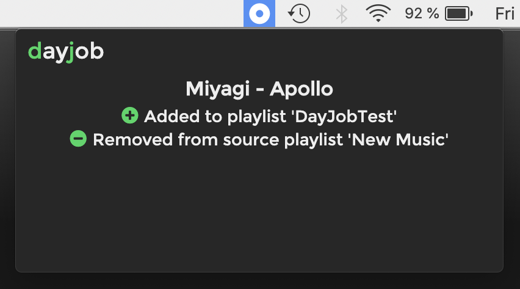
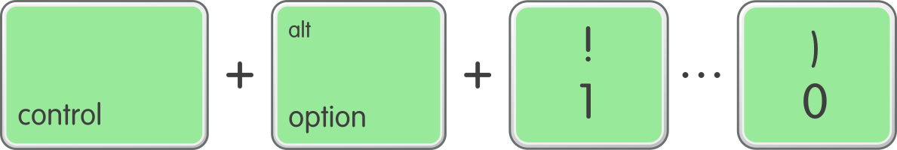
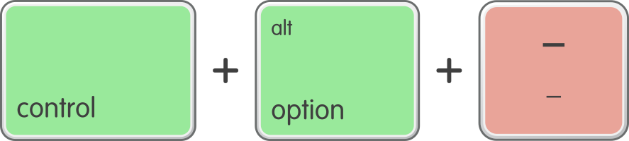

# dayjob

dayjob is a desktop app that lets you add tracks to your favourite playlists by using shortcut keys. It's a great way to make awesome playlists without being distracted from your work.

- Add tracks from any Spotify source (playlists, radio, Discover Weekly etc.)
- Remove and skip boring tracks from the current playlist
- Supports all Spotify players (desktop, mobile, web)
- Cross-platform (written in [Electron](https://electronjs.org/))
- Zero network usage when idle

|                   Play some new music                    |         Hear a good tune? Press a shortcut         |              dayjob adds it to your playlist              |
| :------------------------------------------------------: | :------------------------------------------------: | :-------------------------------------------------------: |
|  |  |  |

## Download

Before downloading please read the [disclaimer](https://opensource.org/licenses/MIT).

|   Get the latest Mac and PC installers on the releases page   |
| :-----------------------------------------------------------: |
| [Releases](https://github.com/simonmetcalfe/dayjob/releases/) |

## Keyboard shortcuts

Add tracks to 10 of your favourite playlists by using the keyboard keys 1, 2, 3, 4, 5, 6, 7, 8 ,9 and 0.

|                                                Shortcut                                                |                         Function                         |
| :----------------------------------------------------------------------------------------------------: | :------------------------------------------------------: |
|           _CTRL_ + _ALT_ + _1_ ... _0_         |                 Add track to playlist #                  |
|   _CTRL_ + _ALT_ + _SHIFT_ + _1_ ... _0_ |                 Move track to playlist #                 |
|              _CTRL_ + _ALT_ + _-_             |            Remove track from current playlist            |
|      _CTRL_ + _ALT_ + _SHIFT_ + _-_     | Remove track from current playlist and skip to next song |

## Limitations

- Tracks can only be moved or removed from a playlist if you are the playlist owner
- If you try to move tracks from a read only source (shared playlist, the radio, artists, etc.) dayjob will warn you and copy the track instead

## Getting started

### Icon and notification window

dayjob creates an icon in the the status / tray area of your computer. It will mostly interact with you through notifications shown here.

### Right-click menu

dayjob will prompt you to set up the Spotify connection on first use, but you use the right-click menu to open the Preferences or to quit at any time.

### Configure Spotify connection

1. Log in to your [Spotify Developer Dashboard](https://developer.spotify.com/dashboard/) and create a new Client ID and use the following settings:
   - App or Hardware Name: _dayjob_
   - App or Hardware Description: _Make great Spotify playlists while you work_
   - What are you building?: _Desktop app_
   - Commercial: _No_
   - Redirect URI: _http://localhost:8888/callback_
1. Enter the Client ID and secret into dayjob
1. Click _Connect to Spotify_ and follow the prompts to authorise

### Add your playlists

1. Right-click on a playlist in the Spotify app, and select _Share > Copy Spotify URI_
1. Goto the _Playlists_ tab in dayjob Preferences and paste the playlist URI into an empty slot
1. Type a name for the playlist.

### Start making playlists!

1. Play some music on Spotify (using the desktop, web or mobile client)
1. When a song is playing that you want to add to a playlist, add it using one of the [keyboard shortcuts](#keyboard-shortcuts).

## History

I created this app because I love discovering new music when at work, but wanted to minimise distractions and the time spent in the Spotify app. I've been using a proof of concept for 2 years, but finally I've been able to release a configurable version that everyone can use.

## Development

I'm not a developer by profession so apologise for any bugs and poor coding practices! dayjob is a simple project and should be easy to maintain. After cloning:

`npm install`

A list of known issues and tech debt is maintained in GitHub which I might get round to some day.

## Building

- The output of the build and package scripts are saved to the /bld directory

| Script                                                   | Description                                                    |
| -------------------------------------------------------- | -------------------------------------------------------------- |
| npm run build-mac-silicon && npm run package-mac-silicon | Builds and packages the app for Mac Silicon (ARM64) processors |
| npm run build-mac-intel && npm run package-mac-intel     | Builds and packages the app for Mac Intel (x64) processors     |
| npm run build-win && npm run package-win                 | Builds and packages the app for Windows (x64)                  |
| npm run build-all && npm run package-all                 | Builds and packages the app for all platforms                  |

- If building for Windows on MacOS, it may be necessary to install the development version of Wine. Uninstall wine-stable (if installed) then install:

`brew install --cask wine@devel`

## Support

Please log any bugs which relate to functionality and I will try and fix them.

Enjoy!

## Credits

Banner image by [StockSnap](https://pixabay.com/users/StockSnap-894430/?utm_source=link-attribution&utm_medium=referral&utm_campaign=image&utm_content=2618446) from [Pixabay](https://pixabay.com/?utm_source=link-attribution&utm_medium=referral&utm_campaign=image&utm_content=2618446)
